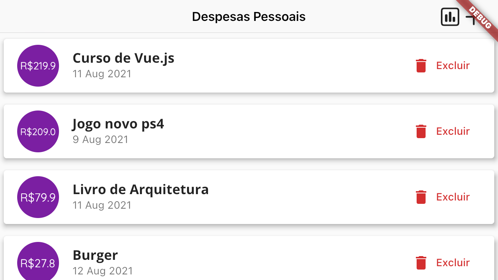

# expenses app

Um app de despesas pessoais. 
As despesas podem ser inseridas de acordo com os dias, e serão mostradas as despesas semanais na forma de um gráfico de barras. 
As barras são calculadas de acordo com os gastos totais da semana, e são pintadas conforme a porcentagem de gastos referente a cada um dos dias. 

Modo retrato, com acesso aos gráficos e à listagem de despesas:

 

Modo paisagem, podendo alternar entre a visualizaçao dos gráficos e a de listagem de despesas:

**Obs.:** *este projeto ainda está em andamento*
